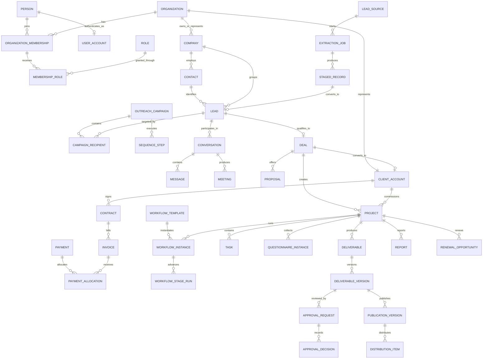
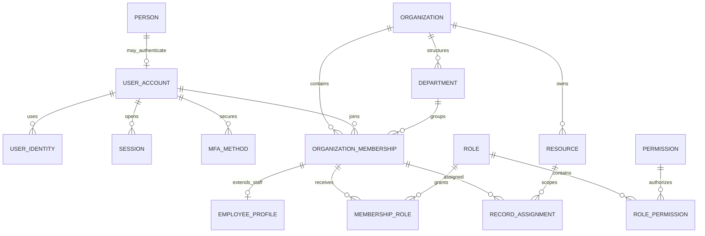
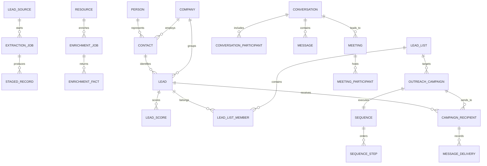
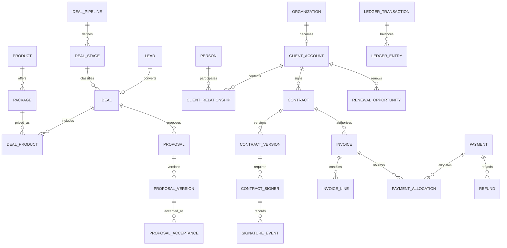
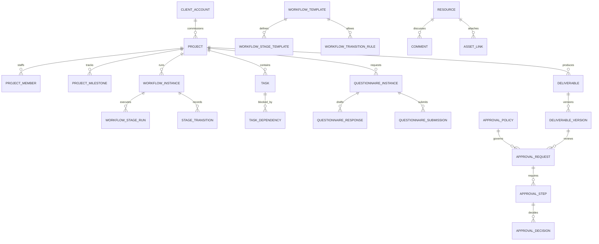
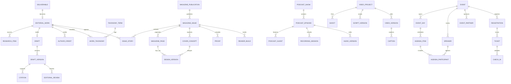
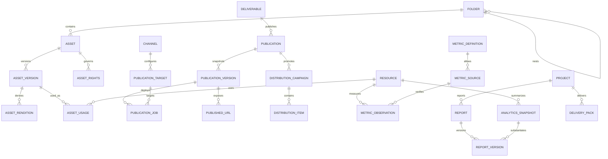

# The Perspective — Phase 2C Master Database & Entity Relationship Architecture

**Status:** Architecture freeze candidate  
**Depends on:** Phase 2A 151-screen route map and Phase 2B 17-role permission baseline  
**Purpose:** Define the shared operational source of truth behind the Team Workspace, Client Portal, and public publishing surfaces.

## 1. Architecture decision

Use a **modular PostgreSQL-compatible transactional database** as the system of record, backed by object storage for binary assets, a search index for discovery, a queue/outbox for reliable asynchronous work, and an analytics store for historical aggregates.

This is one logical platform, not separate Admin, Employee, and Client databases.

```text
Public Site            Team Workspace            Client Portal
www                    app                       client
  \                       |                         /
   \______________________|________________________/
                          |
                 Authorized application API
                          |
      +-------------------+--------------------+
      |                   |                    |
 PostgreSQL system   Object storage       Search index
    of record        and file versions    and projections
      |
 Transactional outbox -> workers/integrations -> analytics warehouse
```

The application begins as a **modular monolith with explicit domain boundaries**. Services may be extracted later, but the canonical IDs, events, ownership rules, and invariants in this document must remain stable.

## 2. Non-negotiable data rules

1. One company/contact/client identity graph; do not recreate a client inside each studio.
2. One Client 360 assembled from shared domain records.
3. One workflow engine with typed templates and immutable workflow definitions.
4. One approval system for editorial, design, commercial, finance, and client decisions.
5. One asset system with immutable versions, rights, usage, and explicit visibility.
6. One unified activity timeline; internal events and client-safe events remain distinguishable.
7. Backend authorization is authoritative. Hidden navigation is never authorization.
8. Every tenant-scoped query filters organization ownership before returning data.
9. Client Portal reads use explicit client-safe projections or serializers, never unrestricted operational rows.
10. Signed contracts, submitted questionnaires, approval decisions, payment-provider events, and published releases are immutable or superseded by a new version.
11. Financial truth comes from invoices, ledger entries, and verified processor events—not editable dashboard totals.
12. Reports label metric provenance and never display invented or unverified performance.

## 3. Storage topology

| Store | Responsibility | Not responsible for |
|---|---|---|
| PostgreSQL | Identity links, operational records, workflow state, money, approvals, metadata, audit | Large media binaries |
| Object storage | Images, audio, video, documents, generated proofs, immutable file versions | Authorization decisions |
| Search index | Full-text and faceted projections for leads, clients, content, files, and portal search | Canonical data |
| Queue/workers | Email sync, extraction, enrichment, media processing, notifications, publishing, metrics ingestion | Durable business truth |
| Analytics warehouse | Time-series aggregates, attribution, verified performance, management reporting | Live transaction mutation |
| Secret manager | OAuth credentials, signing keys, provider secrets | User-visible configuration |

Every asynchronous transaction writes an `outbox_event` in the same database transaction as its business change. A worker publishes and marks it delivered idempotently.

## 4. Identity, organization, and tenant model

### 4.1 Organization types

`organization` is the durable party boundary.

```text
PLATFORM   The Perspective operating company
CLIENT     A paying or prospective client organization
PARTNER    Event, distribution, or commercial partner
VENDOR     External supplier or production vendor
```

People are stored once in `person`. Login capability is attached through `user_account`. A person can be a contact, staff member, author, guest, speaker, or client user without duplicate identity rows.

### 4.2 Memberships

- `organization_membership` connects a user to an organization.
- Staff membership belongs to the Platform organization and may carry department and manager relationships.
- Client Portal access belongs to a Client organization and may carry client-admin capability.
- Public reader/member accounts do not gain staff or client access automatically.
- A single user may hold multiple memberships, but each request has one active organization context.

### 4.3 Ownership columns

Do not use one ambiguous `tenant_id` everywhere. Use explicit columns:

| Column | Meaning |
|---|---|
| `owner_organization_id` | Organization responsible for the record, normally The Perspective |
| `client_organization_id` | Client to which a commercial/delivery record belongs; nullable before conversion |
| `project_id` | Delivery boundary when the record is project-specific |
| `assigned_membership_id` | Individual assignment boundary |
| `department_id` | Department visibility boundary where applicable |
| `visibility` | `INTERNAL`, `CLIENT_SHARED`, or `PUBLIC` |
| `sensitivity` | `STANDARD`, `CONFIDENTIAL`, `PII`, `FINANCIAL`, `SECURITY`, or `SECRET` |

### 4.4 Authorization evaluation

Every protected read or mutation evaluates:

```text
identity
+ active organization membership
+ permission key
+ default role scope (ORG / DEPT / ASN / OWN / CLIENT / READ / NONE)
+ record ownership and assignment
+ workflow stage
+ field visibility
+ approval/separation-of-duty rule
= allow or deny
```

PostgreSQL row-level security is recommended as defense in depth. The application policy layer remains mandatory because workflow and field-level decisions exceed simple row predicates.

## 5. Shared record envelope

Cross-cutting systems need stable foreign keys without unsafe polymorphic text references. Every operational aggregate that can receive files, comments, tasks, approvals, activity, or notifications registers a `resource` row.

```text
resource
- id (UUIDv7)
- resource_type
- owner_organization_id
- client_organization_id nullable
- project_id nullable
- visibility
- sensitivity
- created_at / archived_at
```

Domain rows either share the resource UUID as their primary key or hold a unique `resource_id`. `activity_event`, `comment`, `asset_link`, `approval_request`, `task`, and `notification` reference `resource.id`, retaining referential integrity across domains.

This registry contains routing and security metadata only. Business fields stay in typed domain tables.

## 6. Database conventions

- IDs: UUIDv7; provider IDs are alternate unique keys, never primary keys.
- Time: `timestamptz` in UTC; store user timezone separately.
- Money: integer minor units plus ISO currency; never floating point.
- Percentage/rate: fixed precision decimal.
- Versioning: `version_number`, `supersedes_id`, immutable payload, actor, timestamp.
- Concurrency: `row_version` or updated-at compare-and-swap for collaborative records.
- Deletion: archive by default; restricted permanent erasure requires policy, authority, and audit.
- PII: normalize email/phone for matching, encrypt sensitive values, retain masked display fields where useful.
- JSON: use only for bounded provider payloads, template configuration, and immutable snapshots—not core relationships.
- Slugs: unique within their publication surface and retained through redirects when changed.
- Idempotency: required on payments, webhooks, email ingestion, publishing, distribution, and automation commands.
- Every mutable business table includes `created_at`, `created_by`, `updated_at`, and `updated_by` unless the actor is represented by an append-only event.

## 7. Logical schemas

| Schema/domain | System of record for |
|---|---|
| `iam` | People, users, sessions, organizations, memberships, departments, teams, roles, permissions, assignments |
| `crm` | Lead sources, extraction/enrichment, leads, companies, contacts, lists, qualification |
| `comms` | Sending accounts, campaigns, sequences, conversations, messages, calls, meetings |
| `commercial` | Deals, proposals, products/packages, contracts, invoices, payments, ledger, renewals |
| `delivery` | Clients, projects, workflow templates/instances, stages, tasks, questionnaires |
| `content` | Editorial works, drafts, revisions, citations, comments, reviews |
| `magazine` | Magazines, issues, pages, covers/layouts, proofs, reader builds |
| `media` | Podcast shows/episodes, video productions, guests, recordings, edits |
| `events` | Events, agenda items, speakers, partners, registrations, tickets |
| `assets` | Files, asset versions, rights, usage, renditions, links |
| `approvals` | Approval requests, steps, decisions, exact reviewed-version snapshots |
| `publishing` | Channels, publication targets, immutable publication versions, jobs, URLs, and distribution items |
| `reporting` | Reports, metric definitions, observations, provenance, verified snapshots |
| `platform` | Resources, comments, activity, notifications, automation, outbox, integrations, support |
| `audit` | Append-only sensitive-action and security history |

Schemas are logical ownership boundaries. They do not require separate databases.

## 8. Master relationship map



## 9. Client 360 composition

`client_account` is the commercial/delivery profile of a Client organization; it does not duplicate the organization or contacts.

```text
Client 360
├── organization + contacts + portal memberships
├── originating leads, conversations, meetings, and deals
├── proposals, contracts, invoices, payments, and ledger summary
├── projects, team assignments, workflows, tasks, and milestones
├── questionnaires, shared assets, deliverables, comments, and approvals
├── publications, live links, distributions, and verified reports
├── support requests and client-visible activity
└── renewals, offers, and relationship ownership
```

The Client Portal is a projection of this graph filtered by `client_organization_id`, `visibility = CLIENT_SHARED`, and the user's client membership. It is not a second copy.

## 10. Cross-cutting entity contracts

### 10.1 Activity versus audit

`activity_event` powers human-readable timelines. It may be visible internally or to the client and can contain presentation metadata.

`audit_event` is append-only evidence for security and sensitive actions. It stores actor, impersonator if any, action, resource, before/after hashes or redacted snapshots, request correlation, IP/device where justified, reason, and timestamp. Audit rows are never edited from product UI.

### 10.2 Comments and messages

- `comment` is collaboration attached to a resource/version.
- `message` is a delivered communication in a conversation/channel.
- Both require explicit visibility; author identity never implies client visibility.
- Internal notes remain `INTERNAL` even when written on a client project.

### 10.3 Assets and versions

`asset` describes the logical file; `asset_version` describes an immutable binary. Uploading a replacement creates a new version. `asset_rights` records license, consent, territories, channels, embargo, expiry, credit, and restrictions. `asset_usage` records every publication/design/distribution use.

### 10.4 Deliverables and specialized studios

`deliverable` is the common project output envelope: article, magazine, podcast, video, event package, social creative, report, contract, or other approved type. Specialized tables hold type-specific details. Common workflow, task, approval, asset, publication, and reporting services attach through the deliverable resource.

### 10.5 Approval integrity

An approval request points to an exact immutable version or snapshot. A decision stores:

- actor and represented organization;
- decision and reason;
- exact reviewed version/hash;
- requested and decided timestamps;
- authority rule applied;
- client/internal visibility;
- superseding decision when explicitly overridden.

Changing content after approval invalidates or supersedes approval according to the template rule; it never silently transfers approval to the new version.

### 10.6 Financial integrity

- `invoice` totals are derived from immutable line items and adjustments.
- `payment` records provider-confirmed transactions.
- `payment_allocation` applies payments/refunds to invoices.
- `ledger_entry` is append-only and balanced for financial reporting.
- Manual adjustments require permission, reason, and audit.
- Payment processor webhook events are stored idempotently before projection.

## 11. Public publishing boundary

Operational drafts never render directly on the public site.

```text
approved deliverable version
  -> immutable publication version snapshot
  -> route/SEO/media validation
  -> scheduled or immediate publish command
  -> public read model/cache
  -> distribution items
  -> verified metrics ingestion
```

`publishing.publication_version` freezes title, body/manifest, authors/people, taxonomy, assets, rights, canonical route, SEO, access tier, and publication time. Updates create a new immutable version and preserve URL redirects/history through `published_url` records.

## 12. Data classification and client-safe exposure

Visibility and sensitivity are independent.

| Example | Visibility | Sensitivity |
|---|---|---|
| Public article publication version | `PUBLIC` | `STANDARD` |
| Shared magazine proof | `CLIENT_SHARED` | `CONFIDENTIAL` |
| Internal editorial note | `INTERNAL` | `CONFIDENTIAL` |
| Invoice visible to client | `CLIENT_SHARED` | `FINANCIAL` |
| Margin/internal cost | `INTERNAL` | `FINANCIAL` |
| OAuth refresh token | `INTERNAL` | `SECRET` |

Client-safe DTOs must whitelist fields. The following are always excluded from client output: lead-source/enrichment data, internal sales notes, forecast and margin, staff performance/capacity, internal editorial/QA comments, unshared versions, processor secrets, raw security/audit data, other clients, and private automation metadata.

## 13. Search architecture

Search documents are denormalized projections containing only fields authorized for the target surface:

- `team-search`: operational content with per-document scope metadata;
- `client-search`: only the client's organization and client-shared resources;
- `public-search`: only live publication-version snapshots.

Never index secrets, raw payment data, internal comments, or unrestricted PII. Search results must be re-authorized when opened.

## 14. Integration architecture

| Integration | Inbound truth | Outbound command |
|---|---|---|
| Email/calendar | Provider message/event IDs and sync cursors | Send/schedule through connected account |
| Payments | Signed webhook events | Payment intent/refund request |
| E-signature | Envelope, signer, and completion events | Create/send/void envelope |
| Social/distribution | Delivery status and verified metrics | Schedule/publish item |
| Public CMS/site | Publication result and URL | Publish/unpublish immutable publication version |
| Enrichment/extraction | Job results with provenance/confidence | Start/stop/retry job |
| Media processing | Rendition/transcript job results | Transcode/transcribe/generate rendition |

Each integration has `integration_connection`, encrypted credential reference, health, scopes, cursor, last success/error, and provider-specific configuration. Raw secrets never enter normal database/API responses.

## 15. Performance and indexing baseline

- Composite tenant indexes start with `owner_organization_id` or `client_organization_id`.
- Assignment queues index `(assigned_membership_id, status, due_at)`.
- Workflow queues index `(workflow_instance_id, status, position)` and active stage.
- Client timelines index `(client_organization_id, occurred_at desc)`.
- Conversations index provider account/thread keys and participant identities.
- Finance indexes external provider ID, invoice number, due date/status, and ledger date.
- Publishing indexes canonical route, status, scheduled time, and publication version.
- Notifications index recipient, read state, priority, and created time.
- Audit is time-partitioned and separately retained.
- Large event/message/metric tables should use date partitioning only after measured need; do not prematurely partition transactional tables.

## 16. Retention and deletion

Retention is policy-driven by record class and jurisdiction.

- Contracts, invoices, ledger, payment events, approval evidence, and audit: retained per legal policy; not soft-deleted casually.
- Drafts/assets: archive with version history; purge only when rights, contractual, and hold rules permit.
- Lead/contact PII: purpose and retention review; support erasure/anonymization without corrupting financial evidence.
- Support and communication: retention policy with legal hold support.
- Search/read models: deletable and rebuildable from authorized canonical sources.
- Backups: encrypted, restore-tested, and governed by the same tenant/privacy requirements.

## 17. Transaction boundaries and invariants

The following operations must be atomic:

- lead conversion to deal with identity links;
- deal-won creation of client account/onboarding command;
- contract completion event and resulting activity/outbox event;
- invoice issue with line totals and ledger intent;
- payment/refund projection with allocation and ledger entries;
- workflow transition with stage completion, generated tasks, and outbox events;
- approval decision with exact version and activity event;
- publication-version creation with asset/rights validation;
- portal access grant/revoke with membership and audit event.

## 18. Delivery phases

### Foundation

`iam`, `resource`, organization/client identity, authorization policy, audit, outbox, files, and activity.

### Revenue operations

CRM, outreach, communication, deals, products, proposals, contracts, invoices, payments, and Client 360.

### Delivery operations

Projects, workflow templates/instances, tasks, questionnaires, deliverables, assets, comments, and approvals.

### Studios and publishing

Editorial, magazine, podcast, video, event, publication snapshots, distribution, and public read models.

### Reporting and renewal

Verified metric ingestion, reports, delivery packs, renewal opportunities, analytics, and automation refinement.

## 19. Phase 2C freeze checklist

- [ ] PostgreSQL-compatible system of record accepted.
- [ ] Explicit organization/client/project ownership accepted.
- [ ] Shared person and organization identity model accepted.
- [ ] Resource registry for cross-cutting relationships accepted.
- [ ] Client Portal as an authorized projection, not duplicate data, accepted.
- [ ] Visibility and sensitivity classifications accepted.
- [ ] Immutable version/approval/payment/publication rules accepted.
- [ ] Shared workflow, approval, asset, activity, and audit services accepted.
- [ ] Financial ledger and provider-event truth accepted.
- [ ] Verified metric provenance requirement accepted.
- [ ] Logical domain boundaries and phased delivery accepted.

Once frozen, this architecture is the source of truth for physical schema migrations, API contracts, workflow definitions, and all 151 Phase 2 screens.

## 20. Complete ER diagrams by domain

The master relationship map above shows the lifecycle spine. The following diagrams freeze the remaining high-cardinality relationships without turning one diagram into an unreadable wall.

### Identity, authorization, and tenant context



### CRM, outreach, and communication



### Commercial, client, and finance



### Project, workflow, collaboration, and approvals



### Editorial, magazine, media, and events



### Assets, publishing, distribution, and reporting



## 21. Detailed implementation companions

- [Entity field and PK/FK specification](./PHASE-2C-FIELD-AND-KEY-SPECIFICATION.md)
- [151-screen entity read/write map](./PHASE-2C-SCREEN-ENTITY-MAP.md)
- [PostgreSQL/Prisma, seed, and migration plan](./PHASE-2C-POSTGRES-PRISMA-SEED-MIGRATION.md)
- [Frozen Phase 2D master workflow/state-machine architecture](./PHASE-2D-MASTER-WORKFLOW-STATE-MACHINES.md)
