# Phase 2D — Master Workflow & State-Machine Architecture

**Status:** Frozen canonical workflow source of truth  
**Inputs:** Frozen Phase 2A routes, Phase 2B roles/permissions, and Phase 2C entities/versioning  
**Rule:** UI labels may be localized or shortened, but persisted states, valid transitions, guards, and emitted events come from this contract. No screen may invent a competing persisted state.

Phase 2C defines what data exists. Phase 2D defines how that data changes over time. State is domain-specific: lead, campaign, deal, contract, invoice, project, approval, publication, and renewal are separate machines joined by commands and events rather than one global enum.

## 1. Workflow engine contract

Every transition is a command evaluated against:

```text
current state + requested transition + actor permission + record scope
+ workflow guard + required approvals + required data + idempotency key
```

A successful transition atomically writes:

1. the new aggregate state;
2. an immutable transition/history row;
3. generated tasks or approval requests;
4. a human-readable activity event;
5. a transactional outbox event;
6. an audit event when the transition is sensitive.

Transitions are rejected when the caller has only route visibility but lacks action authority, assignment scope, stage authority, or required field access.

## 2. Master lifecycle

```mermaid
flowchart LR
  A[Lead discovery] --> B[Extraction and enrichment]
  B --> C[Qualification]
  C --> D[Outreach]
  D --> E[Conversation and meeting]
  E --> F[Deal and proposal]
  F --> G[Contract]
  G --> H[Invoice and payment]
  H --> I[Client onboarding]
  I --> J[Project workflow]
  J --> K[Production and reviews]
  K --> L[Client approval]
  L --> M[Publishing]
  M --> N[Distribution]
  N --> O[Verified reporting]
  O --> P[Delivery]
  P --> Q[Renewal or new deal]
```



## 3. Lead and enrichment

### Lead

```text
NEW
  -> EXTRACTED
  -> ENRICHMENT_PENDING
  -> ENRICHED
  -> QUALIFICATION_PENDING
  -> QUALIFIED
  -> OUTREACH_READY
  -> CONTACTED
  -> REPLIED
  -> INTERESTED
  -> CONVERTED
```

Alternative/terminal outcomes: `NOT_QUALIFIED`, `INVALID_CONTACT`, `DO_NOT_CONTACT`, `NO_RESPONSE`, `FOLLOW_UP_LATER`, `DUPLICATE`, `ARCHIVED`.

| Transition | Guard | Side effects |
|---|---|---|
| `NEW → EXTRACTED` | Source/provenance present; extraction result accepted | Preserve extraction evidence; run dedupe |
| `EXTRACTED → ENRICHMENT_PENDING` | Minimum identity and permitted legal basis | Start enrichment job |
| `ENRICHMENT_PENDING → ENRICHED` | Job terminal; accepted facts recorded | Recalculate dedupe and score |
| `ENRICHED → QUALIFICATION_PENDING` | Owner and qualification rubric assigned | Create qualification record/task |
| `QUALIFICATION_PENDING → QUALIFIED` | Required criteria pass | Recalculate outreach/deal eligibility |
| `QUALIFIED → OUTREACH_READY` | Contactability and suppression checks pass | Add only to an approved audience version |
| `OUTREACH_READY → CONTACTED` | Verified send evidence exists | Record first-contact timestamp |
| `CONTACTED → REPLIED` | Inbound reply is matched | Stop unsafe sequence steps; classify reply |
| `REPLIED → INTERESTED` | Positive intent confirmed | Create follow-up task; notify owner |
| `* → DO_NOT_CONTACT` | DNC/legal/privacy event | Stop active outreach and suppress future sends |
| `QUALIFIED → CONVERTED` | Deal created idempotently | Link lead to deal; retain provenance |

Extraction jobs: `QUEUED → RUNNING → PAUSED | COMPLETED | PARTIAL | FAILED | CANCELLED`. Retry creates an attempt; it does not erase prior results.

Enrichment jobs: `QUEUED → RUNNING → REVIEW_REQUIRED → ACCEPTED | PARTIAL | FAILED | CANCELLED`.

## 4. Outreach and conversation

### Campaign

`DRAFT → READY → APPROVED → SCHEDULED → RUNNING → PAUSED → COMPLETED`, with `CANCELLED` and `FAILED` exceptional states.

- Launch requires `outreach.launch`, approved sender/account health, suppression filtering, and a frozen campaign audience/version.
- Editing audience, sequence, or sender after approval returns the campaign to `READY` and invalidates the prior approval.
- Pausing stops future sends but preserves recipient history.

### Campaign recipient

`QUEUED → SENT → DELIVERED → OPENED → CLICKED → REPLIED`, with terminal alternatives `BOUNCED`, `UNSUBSCRIBED`, `STOPPED`, `CONVERTED`. A positive reply stops all remaining automated steps.

### Conversation

`OPEN → PENDING_INTERNAL | WAITING_EXTERNAL → RESOLVED → REOPENED`; spam/irrelevant threads can be `ARCHIVED`. A positive reply may raise `lead.qualified` or `opportunity.requested` but never creates duplicates without an idempotent conversion key.

### Meeting

`PROPOSED → SCHEDULED → CONFIRMED → COMPLETED | CANCELLED | NO_SHOW`, with `RESCHEDULED` represented as an immutable change plus updated schedule.

## 5. Deal and proposal

### Deal

```text
QUALIFIED -> INTERESTED -> DISCOVERY_SCHEDULED -> DISCOVERY_COMPLETED
-> PROPOSAL_PREPARATION -> PROPOSAL_SENT -> NEGOTIATION
-> VERBAL_CONFIRMATION -> CONTRACT_SENT -> CONTRACT_SIGNED
-> PAYMENT_PENDING -> WON
```

Exit states: `LOST`, `ON_HOLD`, `FOLLOW_UP_LATER`, `DISQUALIFIED`.

Rules:

- Moving backwards requires a reason.
- `PROPOSAL` requires at least one deal product/package and contact.
- Discount above threshold requires an approved discount-exception request.
- `WON` requires an accepted proposal or explicit authorized override, client identity, value/currency, and owner.
- `WON` emits an idempotent onboarding command that creates/links Client 360 and the initial project shell.
- `LOST` requires loss reason and may create a future nurture task.

### Proposal

`DRAFT → INTERNAL_REVIEW → APPROVED → SENT → VIEWED → CLIENT_REVIEW → ACCEPTED`, with `CHANGES_REQUESTED`, `DECLINED`, `EXPIRED`, `WITHDRAWN`, and `SUPERSEDED` alternatives.

Any material edit after `APPROVED` creates a new version and returns to `INTERNAL_REVIEW`. Acceptance binds the exact version hash.

## 6. Client onboarding

`NOT_STARTED → PORTAL_INVITED → PORTAL_ACTIVATED → COMMERCIAL_COMPLETE → QUESTIONNAIRE_PENDING → ASSETS_PENDING → KICKOFF_PENDING → IN_PROGRESS → COMPLETED`

Dependencies are evaluated independently, so authorized package templates may run questionnaire, asset, and kickoff preparation in parallel. `BLOCKED` and `CANCELLED` are controlled exception states, not mandatory sequence steps.

Completion gates:

- primary client contact;
- portal membership or documented opt-out;
- contract/payment production gate satisfied per package;
- required questionnaire assigned;
- project owner and initial team;
- workflow template selected;
- client visibility defaults confirmed.

Portal invite states: `DRAFT → SENT → ACCEPTED | EXPIRED | REVOKED`. Reissuing creates a new hashed token.

## 7. Contract

`DRAFT → INTERNAL_REVIEW → APPROVED → SENT → VIEWED → SIGNATURE_PENDING → SIGNED → ACTIVE`, with `CHANGES_REQUESTED`, `DECLINED`, `EXPIRED`, `CANCELLED`, `TERMINATED`, and `SUPERSEDED` alternatives.

Rules:

- Sending freezes a contract version and signer order.
- A material edit after send creates a new version/envelope and supersedes the old one.
- `SIGNED` requires all required signature events verified by the provider.
- `VOIDED` requires authority and reason.
- Signed versions, signer evidence, and provider events are immutable.

## 8. Invoice, payment, and refund

### Invoice

`DRAFT → APPROVED → SENT → OPEN → PARTIALLY_PAID → PAID`, with alternatives `OVERDUE`, `VOID`, `CANCELLED`, `REFUNDED`, `PARTIALLY_REFUNDED`. Legal numbering/issuance is an immutable side effect of `APPROVED → SENT`.

- Issuing assigns the legal invoice number and freezes line items.
- Overdue is derived from due date and open balance.
- Paid/refund states are derived from verified allocations, not manually selected.
- Corrections after issue use adjustment/credit records.

### Payment

`PENDING → PROCESSING → SUCCEEDED | FAILED | CANCELLED`; `SUCCEEDED → PARTIALLY_REFUNDED → REFUNDED`; disputes add `DISPUTED → WON | LOST` without deleting original payment truth.

- Processor webhook truth is verified, deduplicated, and stored before projection.
- Manual payment/adjustment requires Finance authority, reason, evidence, and audit.

### Production gate

Package policy determines the gate, for example:

```text
contract signed AND deposit paid
OR approved finance override with expiry/reason
```

The gate is a derived condition; do not copy a free-form “paid” flag onto projects.

## 9. Project

`DRAFT → PLANNED → ACTIVE → REVIEW → APPROVAL → PUBLICATION_READY → PUBLISHED → DISTRIBUTING → DELIVERY → COMPLETED`, with `ON_HOLD`, `BLOCKED`, `CANCELLED`, and `ARCHIVED` controlled exception states.

- `ACTIVE` requires workflow instance and accountable owner.
- `BLOCKED` includes structured blocker and owner.
- `DELIVERY_REVIEW` requires required deliverables publication-ready or explicitly waived.
- `COMPLETED` requires delivery pack, final report policy, open approval/task check, and completion authority.
- Reopening a completed project creates a new stage run/change order, preserving completion history.

Project health (`ON_TRACK`, `AT_RISK`, `OFF_TRACK`) is separate from lifecycle state.

## 10. Workflow instance, stage, and task

### Workflow instance

`NOT_STARTED → RUNNING → PAUSED | BLOCKED → COMPLETED | CANCELLED`

### Stage run

`PENDING → READY → IN_PROGRESS → INTERNAL_REVIEW → CLIENT_REVIEW → COMPLETE`, with `BLOCKED`, `SKIPPED`, and `CANCELLED` controlled by template rules.

### Task

`BACKLOG → READY → IN_PROGRESS → REVIEW → DONE`, with `BLOCKED`, `CANCELLED`, and `REOPENED` transitions.

- Dependencies determine readiness.
- Due dates/SLA are calculated from template plus calendar.
- A task cannot self-complete an approval step.
- Client tasks must have `CLIENT_SHARED` visibility and an eligible client assignee.

## 11. Questionnaire

`DRAFT → SENT → OPENED → IN_PROGRESS → SUBMITTED → ACCEPTED | CHANGES_REQUESTED → RESUBMITTED`, with `EXPIRED` and `CANCELLED` alternatives.

- Autosave updates the response draft.
- Submit creates an immutable `questionnaire_submission` snapshot.
- Changes requested never mutate the prior submission.
- Client originals and attachments remain versioned.

## 12. Deliverable and draft

### Common deliverable

`PLANNED → IN_PRODUCTION → INTERNAL_REVIEW → CLIENT_REVIEW → APPROVED → PUBLICATION_READY → PUBLISHED → DELIVERED → ARCHIVED`

Alternative/loop states: `BLOCKED`, `CHANGES_REQUESTED`, `REJECTED`, `WITHDRAWN`.

### Draft version loop

```text
WORKING
  -> READY_FOR_REVIEW
  -> IN_REVIEW
  -> APPROVED | CHANGES_REQUESTED
CHANGES_REQUESTED -> WORKING (new version)
APPROVED -> CLIENT_REVIEW or PUBLICATION_READY
```

Writer creates; Editor/Editor-in-Chief reviews. Self-approval is denied when separation-of-duty policy requires another actor.

## 13. Central approval service

### Request

`DRAFT → REQUESTED → IN_REVIEW → APPROVED`, with `CHANGES_REQUESTED`, `REJECTED`, `CANCELLED`, `EXPIRED`, and `SUPERSEDED` outcomes.

### Decision

Immutable values:

`APPROVED`, `APPROVED_WITH_CHANGES`, `CHANGES_REQUESTED`, `REJECTED`.

Guards:

- Exact resource/version/hash is present.
- Actor holds required permission and scope.
- Actor satisfies required organization/role and separation-of-duty policy.
- Client actor belongs to the same `client_organization_id` and request is `CLIENT_SHARED`.
- Decision is idempotent for actor+step+target version.

Content changing after approval produces `SUPERSEDED` or a new request according to policy. Approval never silently applies to a new version.

## 14. Editorial workflow template

```text
PROJECT_CREATED
-> BRIEF_READY
-> QUESTIONNAIRE_PENDING
-> RESEARCH
-> WRITER_ASSIGNED
-> DRAFTING
-> INTERNAL_REVIEW
-> INTERNAL_REVISION
-> CLIENT_REVIEW (when contracted)
-> CLIENT_REVISION
-> CLIENT_APPROVED
-> SEO_REVIEW
-> PUBLICATION_READY
-> SCHEDULED
-> PUBLISHED
-> DISTRIBUTED
-> COMPLETED
```

Required gates may vary by content type, but skipped gates are explicit transition events with authority and reason.

## 15. Magazine / Personal Magazine template

```text
PROJECT_CREATED -> COVER_SLOT_RESERVED -> EDITORIAL_BRIEF
-> QUESTIONNAIRE_CREATED -> QUESTIONNAIRE_SENT -> QUESTIONNAIRE_RECEIVED
-> INTERVIEW_SCHEDULED -> INTERVIEW_COMPLETED
-> ASSETS_REQUESTED -> ASSETS_RECEIVED
-> ARTICLE_DRAFTING -> EDITORIAL_REVIEW -> CLIENT_ARTICLE_REVIEW -> ARTICLE_APPROVED
-> COVER_CONCEPT -> COVER_INTERNAL_REVIEW -> COVER_CLIENT_REVIEW -> COVER_APPROVED
-> PAGE_DESIGN -> INTERNAL_DESIGN_REVIEW -> CLIENT_DESIGN_REVIEW -> DESIGN_REVISION
-> FINAL_PROOF -> FINAL_CLIENT_APPROVAL -> DIGITAL_READER_BUILD
-> PUBLICATION_READY -> PUBLISHED -> DISTRIBUTION -> CLIENT_DELIVERY -> COMPLETED
```

Cover, layout, proof, reader build, and print master use separate immutable versions. Approving one artifact does not approve another.

## 16. Podcast template

```text
PROSPECT -> INVITED -> INTERESTED -> CONFIRMED -> ONBOARDING
-> BIO_ASSETS_PENDING -> TOPIC_PENDING -> TALKING_POINTS_REVIEW
-> SCHEDULING -> RECORDING_SCHEDULED -> RECORDED -> EDITING
-> INTERNAL_REVIEW -> GUEST_REVIEW -> APPROVED -> PUBLICATION_READY
-> PUBLISHED -> CLIPS_CREATED -> DISTRIBUTED -> COMPLETED
```

Alternative outcomes: `DECLINED`, `RESCHEDULE_REQUIRED`, `CANCELLED`, `NO_SHOW`.

Audio masters, transcript versions, artwork, and metadata are independently versioned and can share one approval request only through a frozen manifest.

## 17. Video template

```text
IDEA -> BRIEF -> GUEST_CONFIRMED -> SCRIPTING -> PRE_PRODUCTION
-> SHOOT_SCHEDULED -> SHOT -> EDITING -> INTERNAL_REVIEW
-> CLIENT_REVIEW -> APPROVED -> THUMBNAIL_READY -> METADATA_READY
-> PUBLICATION_READY -> PUBLISHED -> CLIPS_CREATED -> DISTRIBUTED -> COMPLETED
```

## 18. Event template

### Event

`PLANNING → SPEAKER_OUTREACH → SPEAKERS_CONFIRMED → PARTNER_OUTREACH → AGENDA_BUILDING → REGISTRATION_OPEN → PRE_EVENT → LIVE → COMPLETED → POST_EVENT_CONTENT → DISTRIBUTION → REPORTING → CLOSED`, with `POSTPONED` and `CANCELLED` controlled transitions.

### Speaker

`IDENTIFIED → INVITED → INTERESTED → CONFIRMED → ASSETS_PENDING → SESSION_CONFIRMED → LOGISTICS_COMPLETE → ATTENDED → COMPLETED`, with `DECLINED`, `WITHDRAWN`, `NO_SHOW` alternatives.

### Registration/ticket

`PENDING → CONFIRMED → TICKET_ISSUED → CHECKED_IN → ATTENDED`, with `WAITLISTED`, `CANCELLED`, `REFUNDED`, `NO_SHOW` alternatives.

Event workflows must preserve session, speaker, partner, registration, ticket, check-in, consent, and client-deliverable relationships separately.

## 19. Asset lifecycle

`UPLOADED → PROCESSING → AVAILABLE → IN_REVIEW → APPROVED`, with `REJECTED`, `REPLACED`, `ARCHIVED`, and `PROCESSING_FAILED` outcomes.

- Each upload/replacement creates an immutable `asset_version`.
- Rights status is evaluated independently: `UNKNOWN`, `PENDING`, `CLEARED`, `RESTRICTED`, `EXPIRED`, `REVOKED`.
- Publishing is blocked unless required asset rights are `CLEARED` for the intended destination/date.
- Deleting a pointer does not erase versions under contract, approval, publication, or legal hold.

## 20. Publication and distribution

### Release

`DRAFT → EDITORIAL_READY → TECHNICAL_READY → APPROVED → READY_TO_PUBLISH → SCHEDULED → PUBLISHING → PUBLISHED`, with `FAILED`, `BLOCKED`, `UNPUBLISHED`, `ARCHIVED`, and `CORRECTION_PENDING` alternatives.

Validation includes approval, route uniqueness, media availability, rights, access tier, SEO metadata, and destination requirements.

### Publication job

`QUEUED → RUNNING → SUCCEEDED | FAILED | PARTIAL | CANCELLED`. Retry uses the release-version+destination idempotency key.

### Distribution campaign

`DRAFT → ASSETS_READY → APPROVED → SCHEDULED → RUNNING → COMPLETED`, with `PARTIAL`, `FAILED`, and `CANCELLED` alternatives.

### Distribution item

`PENDING → SCHEDULED → PUBLISHING → PUBLISHED`, with `FAILED`, `SKIPPED`, and `REMOVED` alternatives.

Published URLs/provider IDs are evidence. Channel performance enters reporting only through verified metric observations.

## 21. Report and delivery

Report: `COLLECTING_DATA → DRAFT → INTERNAL_REVIEW → APPROVED → CLIENT_READY → DELIVERED`, with `DATA_INCOMPLETE`, `SUPERSEDED`, and `ARCHIVED` alternatives.

Metric observation verification: `INGESTED → VALIDATING → VERIFIED | REJECTED | STALE`.

Client delivery: `PREPARING → READY → SENT → VIEWED → ACKNOWLEDGED → COMPLETED`, with `SUPERSEDED` and `ARCHIVED` alternatives.

A report version freezes the metric cutoff, sources, verification state, narrative, and exact artifact hash.

## 22. Renewal

`NOT_DUE → UPCOMING → REVIEW_REQUIRED → OPPORTUNITY_CREATED → OUTREACH → INTERESTED → PROPOSAL → NEGOTIATION → RENEWED`, with `DECLINED`, `LOST`, `DEFERRED`, and `EXPIRED` alternatives.

Project completion schedules the renewal evaluation. Suggestions remain recommendations until an authorized commercial user creates a new deal.

## 23. Support ticket

`OPEN → TRIAGED → IN_PROGRESS → WAITING_ON_CLIENT | WAITING_INTERNAL → RESOLVED → CLOSED`, with `REOPENED` and `CANCELLED` transitions.

- Client-visible thread messages are explicit.
- Internal notes are separate and never returned in Client Portal serializers.
- Resolution and close retain history and attachments.

## 24. Transition authority summary

| Sensitive transition | Required authority |
|---|---|
| Campaign `APPROVED/SCHEDULED/PAUSED → SCHEDULED/RUNNING` | Super Admin, Admin, Sales Manager |
| Proposal `APPROVED → SENT` | Approved commercial roles from Phase 2B |
| Discount exception approval | Super Admin, Admin, Sales Manager, Finance Manager |
| Contract send/void | Authorized commercial/finance roles |
| Invoice issue/send | Super Admin, Admin, Finance Manager |
| Payment adjustment/refund | Super Admin, Admin, Finance Manager |
| Client deliverable decision | Client member in same client organization and approval scope |
| Editorial approval | Super Admin, Admin, Editor-in-Chief, Editor as policy allows |
| Magazine cover/layout approval | Super Admin, Admin, Editor-in-Chief |
| Approval override | Super Admin, Admin, Editor-in-Chief; reason/audit mandatory |
| Publish execution | Super Admin, Admin, Editor-in-Chief, Marketing & Distribution |
| Distribution launch | Super Admin, Admin, Marketing & Distribution |
| Role/permission change | Super Admin, Admin |

## 25. Required domain events

Stable event names use past tense and carry IDs, not unrestricted domain payloads.

```text
lead.extracted
lead.enrichment_requested
lead.enriched
lead.qualified
lead.outreach_ready
lead.contacted
lead.replied
lead.positive_reply
lead.do_not_contact
lead.converted
meeting.scheduled
meeting.completed
deal.stage_changed
deal.won
proposal.sent
proposal.accepted
client.portal_access_granted
contract.sent
contract.signed
invoice.sent
invoice.opened
invoice.overdue
payment.succeeded
payment.failed
payment.refunded
project.created
workflow.stage_entered
workflow.stage_completed
task.assigned
questionnaire.submitted
asset.uploaded
asset.rights_cleared
deliverable.version_created
approval.requested
approval.decided
approval.overridden
release.scheduled
release.published
distribution.completed
report.delivered
project.completed
renewal.due
renewal.converted
support.requested
```

Consumers must be idempotent. Event schemas are versioned. Sensitive or client-ineligible fields are retrieved through authorized APIs, not embedded in broadcast payloads.

## 26. Automation baseline

| Trigger | Command | Guard |
|---|---|---|
| Positive reply | Create qualification/opportunity task | Not suppressed; no active duplicate |
| Deal won | Create/link client and onboarding/project shell | Accepted offer or authorized override |
| Contract signed | Notify owners and evaluate production gate | Verified final signature event |
| Payment succeeded | Recalculate invoice and production gate | Verified, deduplicated provider event |
| Questionnaire submitted | Create writer/editor tasks | Exact submitted version |
| Draft ready | Request internal review | Required citations/assets present |
| Internal approval | Request client review if contracted | Exact approved version |
| Client changes requested | Create revision stage/task | Same client org and current request |
| Final approval | Mark publication-ready candidate | Rights and required approvals valid |
| Release published | Create distribution campaign/items | Verified public release/URL |
| Project completed | Create renewal evaluation | Delivery/completion gates satisfied |

Automations never bypass permission or approval guards. They run as a declared system principal and record the originating actor/event.

## 27. Canonical lifecycle registry

| Machine key | Aggregate | Canonical state authority |
|---|---|---|
| `lead.lifecycle` | `crm.lead` | Section 3 |
| `outreach.campaign` / `outreach.recipient` | `comms.campaign`, recipient | Section 4 |
| `sales.deal` / `sales.proposal` | `commercial.deal`, proposal | Section 5 |
| `client.onboarding` | `commercial.client_account` + onboarding workflow | Section 6 |
| `commercial.contract` | `commercial.contract` | Section 7 |
| `finance.invoice` / `finance.payment` | invoice, payment | Section 8 |
| `project.lifecycle` | `delivery.project` | Section 9 |
| `workflow.instance` / `stage.run` / `task.lifecycle` | delivery workflow records | Section 10 |
| `questionnaire.lifecycle` | questionnaire instance/submission | Section 11 |
| `deliverable.lifecycle` / `draft.review` | deliverable/content versions | Section 12 |
| `approval.lifecycle` | approval request/decision | Section 13 |
| `editorial.production` | workflow instance for article/blog | Section 14 |
| `magazine.production` | workflow instance for magazine/personal magazine | Section 15 |
| `podcast.production` | workflow instance for podcast | Section 16 |
| `video.production` | workflow instance for video | Section 17 |
| `event.lifecycle` / `event.speaker` | event and speaker relation | Section 18 |
| `asset.lifecycle` / `asset.rights` | asset/version/rights | Section 19 |
| `publication.lifecycle` / `publication.job` | publication and job | Section 20 |
| `distribution.campaign` / `distribution.item` | distribution records | Section 20 |
| `report.lifecycle` / `delivery.pack` | report and delivery pack | Section 21 |
| `renewal.lifecycle` | renewal opportunity | Section 22 |
| `support.ticket` | support ticket | Section 23 |

## 28. Global transition invariants

1. Every command supplies expected current state and row/version token; stale commands fail with a conflict.
2. Every accepted transition writes domain history, activity, audit evidence for sensitive actions, and an outbox event in one transaction.
3. A transition never mutates an approved/signed/submitted/published version. It creates a successor and supersedes the prior review request when required.
4. Internal review and client review are distinct states, scopes, comments, and approvals.
5. Client commands require `CLIENT` scope, matching `client_organization_id`, an active project membership, and `CLIENT_SHARED` target visibility.
6. Finance states derive from invoices, allocations, verified provider events, and ledger evidence; ordinary UI fields cannot assert payment truth.
7. Publishing requires the exact approved content/design/media manifest, cleared rights, canonical target, and idempotent job key.
8. `SKIPPED`, backward, reopen, override, cancel, archive, and retry transitions require an explicit policy, actor authority, and reason.
9. Retry creates a new attempt while preserving failed evidence. Reopen creates a new stage iteration or successor version.
10. Automation runs as a named system principal and cannot bypass the same guards required of a human command.

## 29. Phase 2D frozen companions

- [Transition Rules](./PHASE-2D-TRANSITION-RULES.md)
- [Automation Event Catalog](./PHASE-2D-AUTOMATION-EVENT-CATALOG.md)
- [SLA & Escalation Matrix](./PHASE-2D-SLA-ESCALATION-MATRIX.md)
- [151-Screen Workflow Map](./PHASE-2D-SCREEN-WORKFLOW-MAP.md)
- [Workflow Diagrams](./PHASE-2D-WORKFLOW-DIAGRAMS.md)

## 30. Freeze acceptance

- [x] Every major lifecycle has one canonical machine.
- [x] Screens cannot invent duplicate persisted states.
- [x] Transition authority, scope, guards, fields, blockers, effects, events, visibility, and reopen behavior are specified.
- [x] Client actions are restricted to client-safe records and exact visible versions.
- [x] Internal and client review are distinct.
- [x] Approved, signed, submitted, paid, and published evidence is immutable or superseded.
- [x] Finance and publishing cannot bypass evidence or approval gates.
- [x] Failure, retry, blocked, cancelled, skipped, revision, and reopen behavior is defined.
- [x] Events and SLA policies are canonical and configurable.
- [x] All 151 Phase 2A screens are mapped in the companion screen map.
