# Phase 2D — Workflow Diagrams

**Status:** Frozen  
**Notation:** solid arrows are normal transitions; dotted arrows are configured skips/optional branches; red-labelled nodes are controlled exceptions.

## 1. Platform master lifecycle

```mermaid
flowchart LR
  A[Lead Discovery] --> B[Extraction]
  B --> C[Enrichment]
  C --> D[Qualification]
  D --> E[Outreach]
  E --> F[Reply]
  F --> G[Opportunity / Meeting]
  G --> H[Proposal / Negotiation]
  H --> I[Contract]
  I --> J[Invoice / Payment]
  J --> K[Client / Onboarding]
  K --> L[Project / Production]
  L --> M[Internal Review]
  M --> N[Client Review]
  N --> O[Approval]
  O --> P[Publishing]
  P --> Q[Distribution]
  Q --> R[Reporting]
  R --> S[Delivery]
  S --> T[Renewal]
  T -->|new opportunity| G
```

Each box is a domain boundary, not one shared status enum.

## 2. Sales: lead, outreach and deal

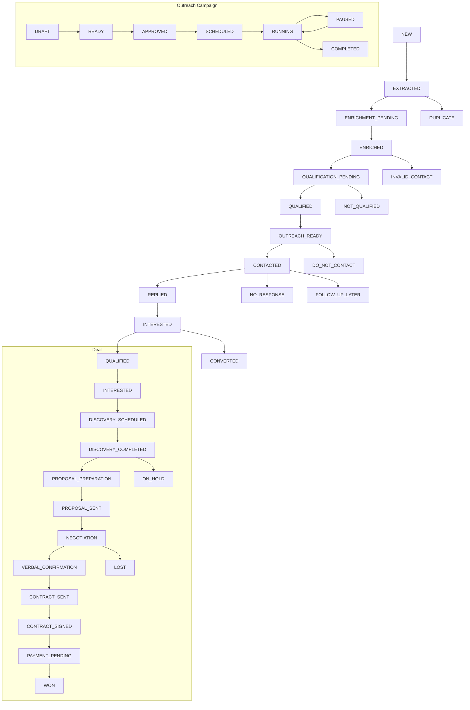

A positive reply emits `lead.positive_reply`, stops remaining recipient steps, and creates an owner follow-up.

## 3. Commercial and finance

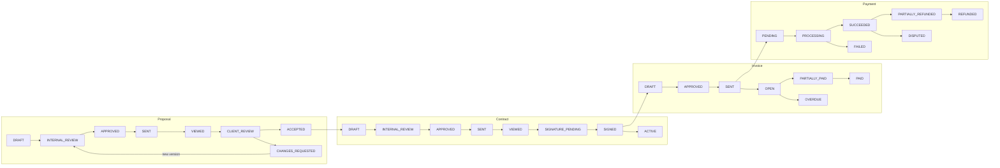

Invoice/payment projections derive from verified allocations and processor evidence; the UI cannot manually assert success.

## 4. Generic project and approval loop

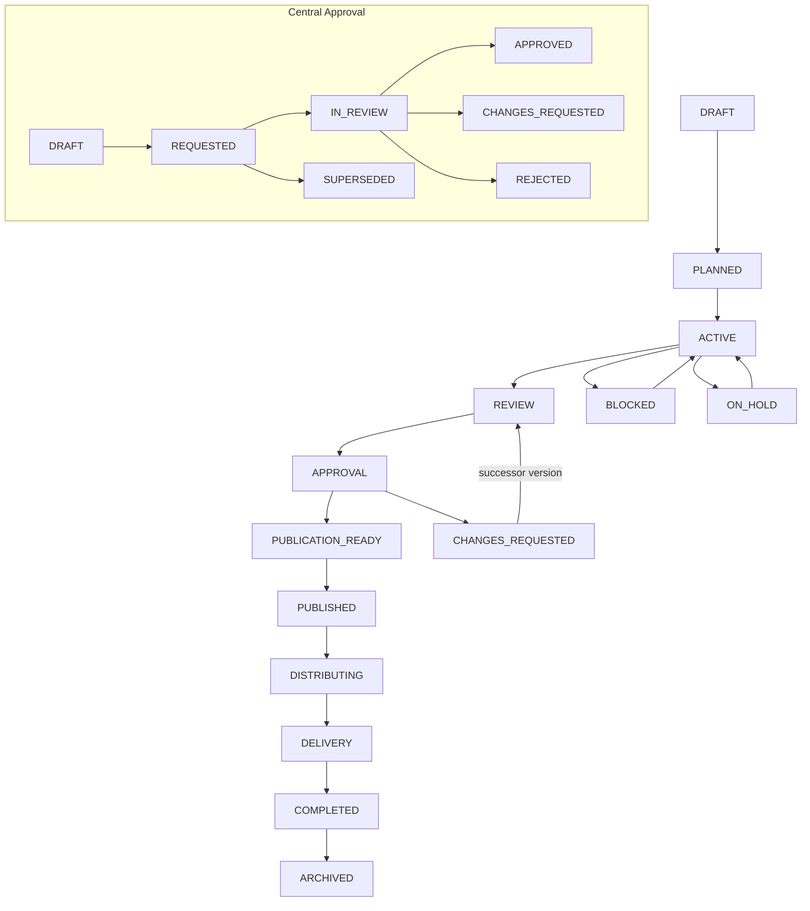

The approval target is an immutable version/hash. A changed resource supersedes the old request.

## 5. Editorial article/blog

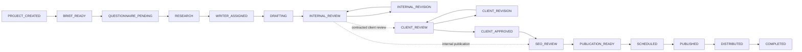

Client review is a template policy branch; skipping it is an auditable transition, not a hidden UI shortcut.

## 6. Magazine and Personal Magazine

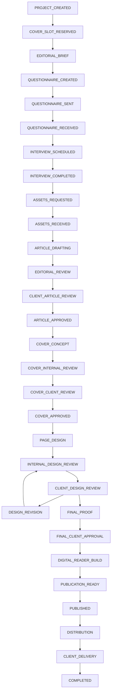

Package templates may skip declared stages only when the skip policy, authority and reason are stored.

## 7. Podcast

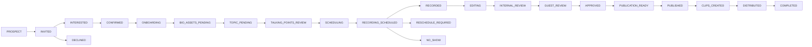

## 8. Video

```mermaid
flowchart LR
  I[IDEA] --> B[BRIEF] --> GC[GUEST_CONFIRMED] --> S[SCRIPTING]
  S --> PP[PRE_PRODUCTION] --> SS[SHOOT_SCHEDULED] --> SH[SHOT] --> E[EDITING]
  E --> IR[INTERNAL_REVIEW] --> CR[CLIENT_REVIEW] --> A[APPROVED]
  A --> T[THUMBNAIL_READY] --> M[METADATA_READY] --> PR[PUBLICATION_READY]
  PR --> PUB[PUBLISHED] --> CL[CLIPS_CREATED] --> D[DISTRIBUTED] --> C[COMPLETED]
  CR -->|successor edit| E
```

## 9. Event and speakers

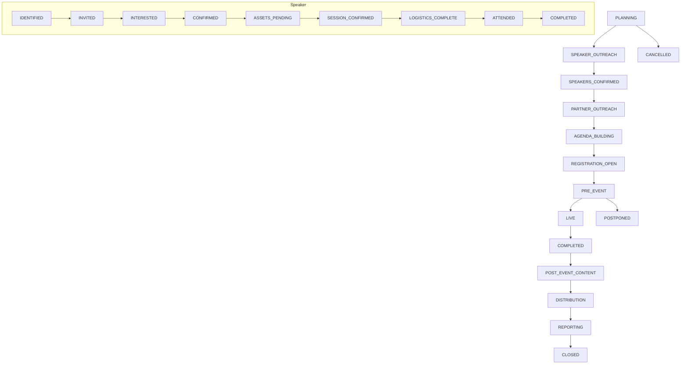

## 10. Publishing and distribution

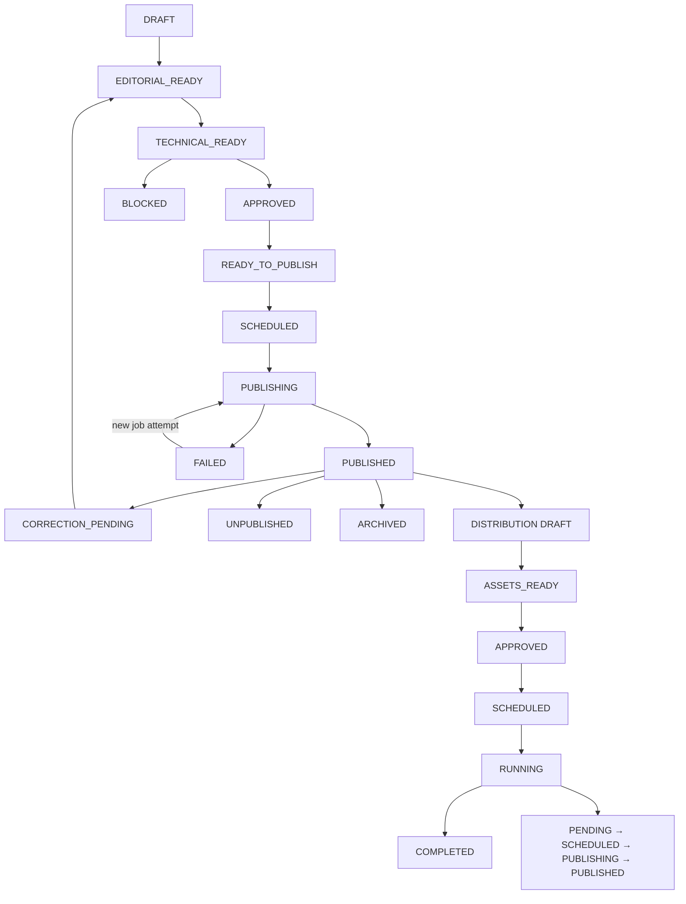

Publication retry creates a new job attempt with the same release-version/destination idempotency key.

## 11. Reporting, delivery and renewal

```mermaid
flowchart LR
  CD[COLLECTING_DATA] --> D[DRAFT] --> IR[INTERNAL_REVIEW] --> A[APPROVED]
  A --> CR[CLIENT_READY] --> DL[DELIVERED]
  CD --> DI[DATA_INCOMPLETE]

  DL --> PREP[DELIVERY PREPARING] --> READY[READY] --> SENT[SENT]
  SENT --> VIEW[VIEWED] --> ACK[ACKNOWLEDGED] --> COMP[COMPLETED]

  COMP --> ND[NOT_DUE] --> UP[UPCOMING] --> RR[REVIEW_REQUIRED]
  RR --> OC[OPPORTUNITY_CREATED] --> O[OUTREACH] --> INT[INTERESTED]
  INT --> PROP[PROPOSAL] --> NEG[NEGOTIATION] --> REN[RENEWED]
  REN -->|successor Deal / Project| OC
```

`RENEWED` links a successor deal/project and never mutates the completed predecessor.

## 12. Client-safe approval example

```mermaid
sequenceDiagram
  participant C as Client
  participant API as Command API
  participant P as Policy Engine
  participant A as Approval Aggregate
  participant O as Outbox/Automation

  C->>API: approve exact designVersionId
  API->>P: verify CLIENT scope, membership, visibility, active request
  P-->>API: allowed
  API->>A: IN_REVIEW → APPROVED (expectedVersion)
  A-->>API: immutable ApprovalDecision
  API->>O: approval.approved
  O-->>O: notify AM + Designer; recalculate readiness
  API-->>C: approved version + updated client-safe state
```

If a newer version exists, the command returns a stale/superseded conflict and creates no decision.

